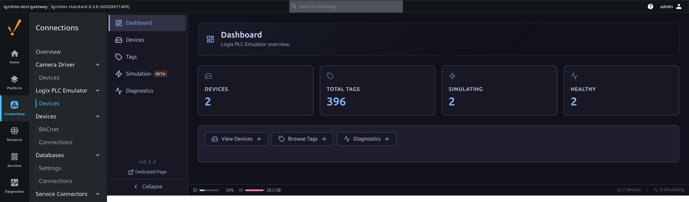
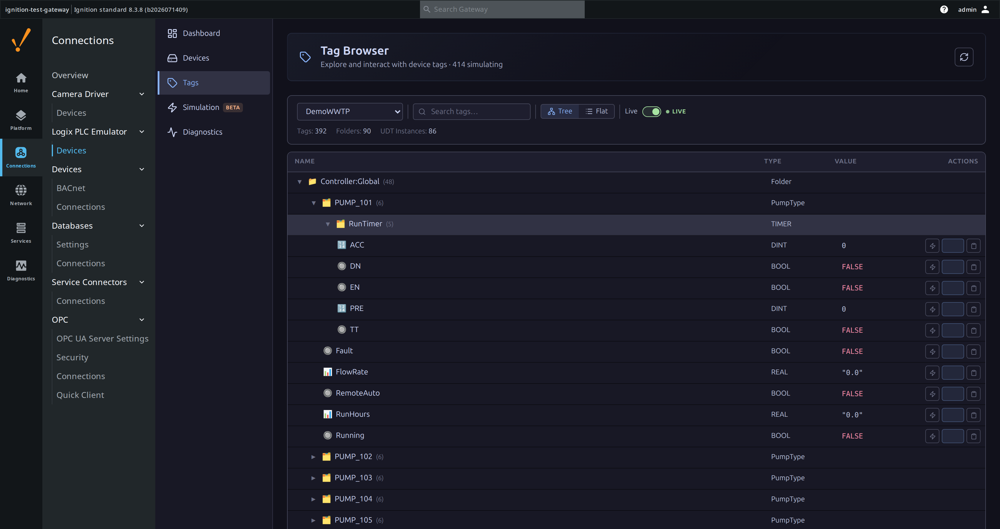
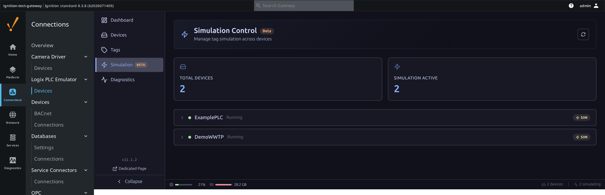
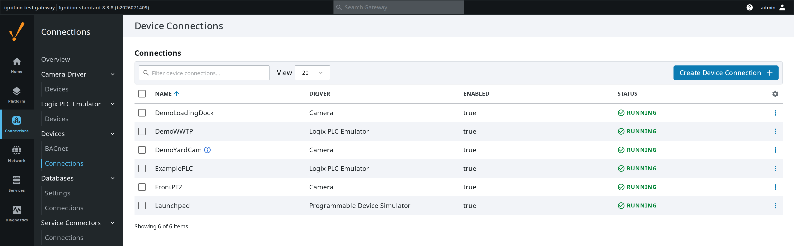
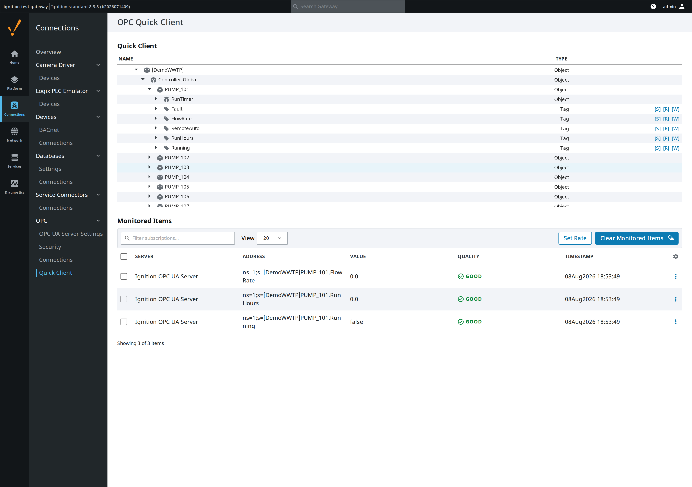

# Logix PLC Emulator

An Ignition module that turns a real Rockwell Logix program export into a fully-tagged, live-simulated test PLC — no hardware required.

## Why this exists

Ignition projects are built against the tag structures of real PLCs — but the
real PLC is usually unavailable: it's running a plant, it's on a customer
site, or it doesn't exist yet. Generic simulators don't help, because the hard
part isn't producing changing values; it's matching the **exact** tag tree the
project will bind to — UDTs, AOIs, arrays and all.

**This module turns the PLC's own program export into the test PLC.** Feed it
the L5K file from Studio 5000 and it emulates that controller's complete tag
structure through Ignition's OPC-UA server, with configurable simulated
values and hot-reload — develop, demonstrate, and acceptance-test with zero
PLC hardware and zero risk to a running plant.

The full purpose, definition of done, and permanent won't-do list live in
[docs/PROJECT_CHARTER.md](docs/PROJECT_CHARTER.md) — the charter drives every
release decision.

## What it looks like

The screenshots below are a synthetic demo plant program — `DemoWWTP`, a
hand-written L5K export with generic pump/valve/tank tags (392 tags, 86 UDT
instances) invented for these screenshots — emulated on a live 8.3.8 test
gateway. The module parses real site exports just as well (that's what the
fidelity test corpus is for); a synthetic device is pictured here so nothing
published identifies a real facility.


*The module's landing page inside Gateway Config: two emulated devices
(`DemoWWTP` plus Ignition's built-in `ExamplePLC`), 396 combined tags, live
simulation status at a glance — this is the "is it working" screen.*


*The Tag Browser expanded into a synthetic pump UDT (`PUMP_101`) nested under
`Controller:Global`, Live mode on, showing its `RunTimer`/`Fault`/`FlowRate`/
`RemoteAuto`/`RunHours`/`Running` members. Folder counts, data types and
values all come from the parsed program — nothing here is placeholder data.
(The header reads "414 simulating" while the panel below it reads "Tags:
392" — both are correct, they're just counting different things: 392 is the
tags the L5K parser declared, while 414 is the individually-simulated OPC-UA
values, which is higher because two array tags — `ANALOG_INPUTS` (`REAL[16]`)
and `ALARM_WORDS` (`DINT[8]`) — are each one declared tag but simulate as one
value per element: 392 − 2 + 16 + 8 = 414.)*


*Bulk simulation enabled with one click per device — both `ExamplePLC` and
`DemoWWTP` show `SIM` active. This is what "acceptance-test with zero PLC
hardware" looks like in practice.*


*The emulator is a normal Ignition device driver: `DemoWWTP` shows up under
Devices → Connections next to every other driver — camera devices, the
built-in `ExamplePLC`, and the Programmable Device Simulator — `RUNNING` like
any real one.*


*Proof the emulation is real OPC-UA, not a UI trick: the standard Ignition
Quick Client browses into `[DemoWWTP]PUMP_101.FlowRate` and friends and
subscribes with `GOOD` quality — any Designer, script or binding sees the
same thing.*

## What it does

| Capability | Detail |
| --- | --- |
| Device driver | Appears as a standard OPC-UA device connection, `RUNNING`/`FAULTED` like any real driver |
| Driver-matching tag addressing | NodeIds are swap-compatible with Ignition's native Allen-Bradley Logix driver — see [Tag Addressing](#tag-addressing) |
| Rockwell L5K import | Full UDT/AOI expansion, 22 predefined types, module I/O tags — grammar-verified against real site exports |
| JSON / CSV import | Generic tag definitions and variable lists, for non-Rockwell test scenarios |
| Simulation engine | STATIC, RAMP, SINE, RANDOM, TOGGLE patterns, per-tag or bulk-by-scope |
| Hot reload | Tag tree updates automatically when the PLC file changes on disk, including array and nested-member changes |
| Connection Browser UI | Single-page app: Dashboard, Devices, Tags, Simulation, Diagnostics — tag exploration, live values, writes, file upload |
| File versioning | Last 5 versions kept; list and revert via REST or the UI |
| Security | Path traversal prevention, rate limiting, gateway auth on every route, `ExternalAccess`-based read-only enforcement |

## How to use it

1. **Install.** Download `LogixPLCEmulator-{version}.modl` from
   [releases](../../releases), open Gateway Config → System → Modules →
   *Install or Upgrade a Module*, and select the file. The module ships
   signed with the Gaskony keystore.
2. **Create a device.** Config → OPC UA → Device Connections → *Create New
   Device* → device type **Logix PLC Emulator**. Give it a name, pick a
   **Parser Type** (Rockwell/L5K, JSON or CSV), and either paste/upload a
   file straight away or save first and add the file later from the
   Connection Browser.
3. **Browse it.** Open the **Logix PLC Emulator** section under Connections
   in the left nav (or the *Devices* page directly) to reach the Connection
   Browser. The **Tags** view shows the parsed tree with live values; the
   **Simulation** view turns on changing values without touching the source
   file; **Diagnostics** shows engine health.
4. **Bind to it like a real PLC.** Because NodeIds match the native
   Allen-Bradley Logix driver, any binding built against the emulator works
   unchanged when the emulated device is swapped for the real one later.

---

## Tag Addressing

The emulator's OPC-UA NodeIds are **swap-compatible with Ignition's native
Allen-Bradley Logix driver** — a tag binding developed against the emulator
works unchanged when the device is swapped for the real PLC (charter §2.2).
Controller-scoped tags are addressed by the bare tag name (`SystemClock`),
program-scoped tags use `Program:<ProgramName>.<Tag>`, arrays fully expand to
their elements, and BOOL arrays are DWORD-packed (`Tag[word].bit`) exactly as
the real driver requires. The full grammar for every construct (UDT/AOI
members, multi-dimensional arrays, predefined types, module I/O tags,
External Access) is normative in [docs/ADDRESSING.md](docs/ADDRESSING.md).

## Supported Formats

- **Rockwell L5K** (Allen-Bradley Studio 5000 / RSLogix 5000 export) — **the
  only supported Rockwell format.** Full UDT/AOI expansion, driver-matching
  NodeIds, module I/O tags, grammar-specified and verified against real site
  exports. Fails loudly with a clear error on export text it cannot parse
  rather than silently substituting a demo tag structure.
- **Rockwell L5X** (XML export) — **not supported.** Uploading a `.l5x` is
  rejected with a message asking you to export as L5K instead. Support was
  removed in 11.0.0; see [CHANGELOG.md](CHANGELOG.md).
- **JSON** — Generic JSON tag definitions.
- **CSV** — Variable lists.

### Rockwell Logix Features

- Driver-matching NodeIds for every construct (see [Tag Addressing](#tag-addressing))
- 22 predefined types (TIMER, COUNTER, PID, PIDE, …), matched against Rockwell reference manuals and real exports
- Full UDT expansion with nested members, array-of-UDT and array members inside a UDT
- AOI support, including `EnableIn`/`EnableOut`
- Hierarchical browse structure matching real CompactLogix/ControlLogix PLCs
- Process Control: PID, PIDE, ALARM_ANALOG, ALARM_DIGITAL
- Motion Control: AXIS_CIP_DRIVE, AXIS_VIRTUAL, MOTION_GROUP, CAM ([known limitations](docs/KNOWN_ISSUES.md))

## The Web UI

The Connection Browser is a single-page app mounted into Gateway Config under
**Connections → Logix PLC Emulator → Devices** (also reachable directly at
`/app/logix-connection-browser`, or as a standalone full-page view via the
"Dedicated Page" link in its sidebar). It has five views:

- **Dashboard** — device/tag counts, simulation and health status at a glance
- **Devices** — upload/replace PLC files, inspect status, manage file versions
- **Tags** — tree or flat browsing, live values, inline write, per-tag simulate
- **Simulation** *(beta)* — enable/disable simulation in bulk, by scope or globally
- **Diagnostics** — simulation engine and device health detail

## API Endpoints

All routes require authentication (Gateway login) except `/health`.

| Method | Endpoint | Description |
| -------- | ---------- | ------------- |
| POST | `/data/logixemulator/upload` | Upload PLC file to device |
| GET | `/data/logixemulator/devices` | List all emulated devices |
| GET | `/data/logixemulator/device/:name/status` | Device status and file info |
| GET | `/data/logixemulator/device/:name/tags` | Get tag tree (paginated) |
| GET | `/data/logixemulator/device/:name/tags/children` | Get children of a tag/folder path |
| GET | `/data/logixemulator/device/:name/tags/live` | Live tag values |
| GET | `/data/logixemulator/device/:name/tags/simulated` | List currently-simulated tag paths |
| POST | `/data/logixemulator/device/:name/tag/write` | Write tag value |
| POST | `/data/logixemulator/device/:name/tag/simulate` | Toggle per-tag simulation |
| POST | `/data/logixemulator/device/:name/simulation/scope` | Bulk enable/disable by scope |
| POST | `/data/logixemulator/device/:name/simulation/all` | Enable/disable all simulation |
| GET | `/data/logixemulator/device/:name/versions` | List retained file versions (last 5) |
| POST | `/data/logixemulator/device/:name/versions/revert` | Revert to a previous file version |
| DELETE | `/data/logixemulator/device/:name/delete` | Delete device file |
| GET | `/data/logixemulator/system/stats` | System-level stats |
| GET | `/data/logixemulator/system/logs` | Recent gateway log lines |
| GET | `/data/logixemulator/health` | Health check (public) |

## Documentation

- **[QUICK_START.md](docs/QUICK_START.md)** - Quick start guide
- **[BUILD.md](docs/BUILD.md)** - Building and packaging
- **[SIGNING.md](docs/SIGNING.md)** - Module signing configuration
- **[TESTING.md](docs/TESTING.md)** - Testing procedures
- **[DEVELOPMENT.md](docs/DEVELOPMENT.md)** - Development guide
- **[CHANGELOG.md](CHANGELOG.md)** - Version history
- **[SECURITY_TESTING.md](docs/SECURITY_TESTING.md)** - Security documentation

## Status

**Status**: Production Ready
**Requires**: Ignition 8.3+ | Java 17

## Building

```bash
cd logix-emulator-module
chmod +x gradlew
./gradlew clean build
```

The signed module will be at `build/LogixPLCEmulator-{version}.modl`.

## Licence

Apache License 2.0 — see [LICENSE](LICENSE) for details.
